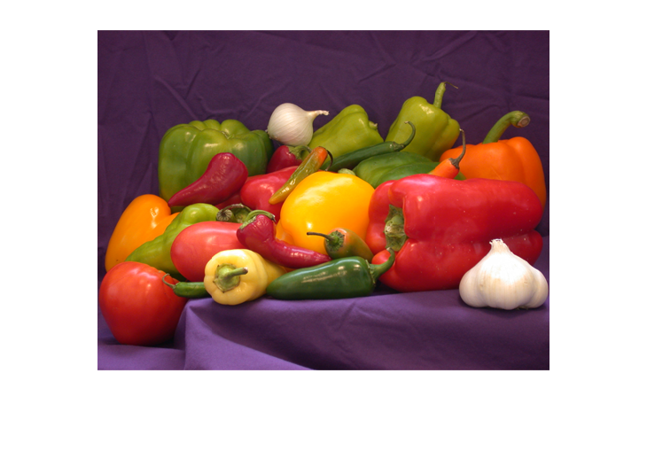

# addUserMessageWithImages

Add user message with images to message history


`updatedMessages = addUserMessageWithImages(messages,content,images)`


`___ = addUserMessageWithImages(___,Name=Value)`

# Description

`updatedMessages = addUserMessageWithImages(messages,content,images)` adds a user message with images to the [`messageHistory`](messageHistory.md) object `messages`.


`___ = addUserMessageWithImages(___,Detail=detail)` also specifies the image resolution to send to the model.

# Examples
## Generate Image Description Using OpenAI Chat

First, specify the OpenAI® API key as an environment variable and save it to a file called `".env"`. Next, load the environment file using the `loadenv` function.

```matlab
loadenv(".env")
```

Create an `openAIChat` object.

```matlab
model = openAIChat;
```

Initialize the message history.

```matlab
messages = messageHistory;
```

View the image `"peppers.png"`, which is included in your MATLAB® installation.

```matlab
image = "peppers.png";
imshow(image)
```



Add a user message including the image to the message history.

```matlab
messages = addUserMessageWithImages(messages,"Describe the image.",image);
messages.Messages{1}
```

```matlabTextOutput
ans = struct with fields:
            role: "user"
         content: "Describe the image."
          images: "peppers.png"
    image_detail: "auto"

```

Generate text.

```matlab
generate(model,messages,MaxNumTokens=30)
```

```matlabTextOutput
ans = "The image features a colorful assortment of various types of peppers and garlic. The peppers come in a range of colors, including red, yellow, green,"
```
# Input Arguments
### `messages` — Message history

`messageHistory` object


Message history, specified as a [`messageHistory`](messageHistory.md) object.

### `content` — Message content

string scalar | character vector


Message content, specified as a string scalar or character vector. The content must be nonempty.

### `images` \- Images

string scalar | string array


Input image, specified as a PNG (\*.png) file.

## Name\-Value Arguments
### `Detail` — Image resolution

`"auto"` (default) | `"high"` | `"low"`


Specify the resolution of the image you pass to the large language model. 


If you set the image resolution to `"low"`, then the `generate` function sends a 512\-by\-512 version of the image to the LLM. 


If you set the image resolution to `"high"`, then the `generate` function also sends the full image in chunks of 512\-by\-512 tiles. This option can be more expensive.


If you set the image resolution to `"auto"`, then the resolution sent to the model depends on the image size.


For more information, see [https://platform.openai.com/docs/guides/vision](https://platform.openai.com/docs/guides/vision).

# Output Argument
### `updatedMessages` — Updated message history

`messageHistory` object


Updated message history, specified as a `messageHistory` object. The updated message history includes a new structure array with these fields:

-  role —`"user"` 
-  content — Set by the `content` input argument 
-  images — Set by the `images` input argument 
-  image\_detail — Set by the `Detail` name\-value argument 
# See Also

[`messageHistory`](messageHistory.md) | [`generate`](generate.md)


*Copyright 2024 The MathWorks, Inc.*

