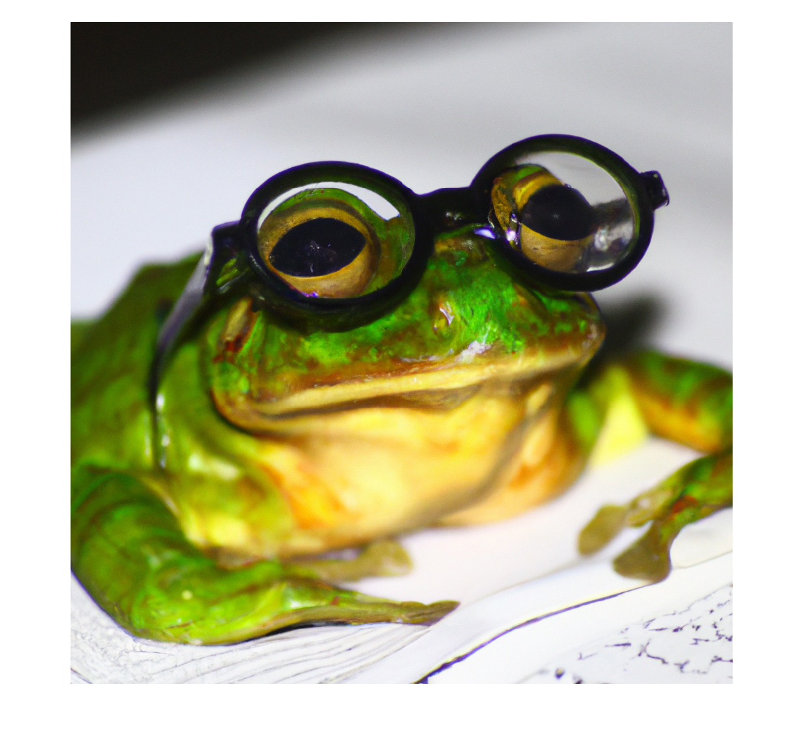
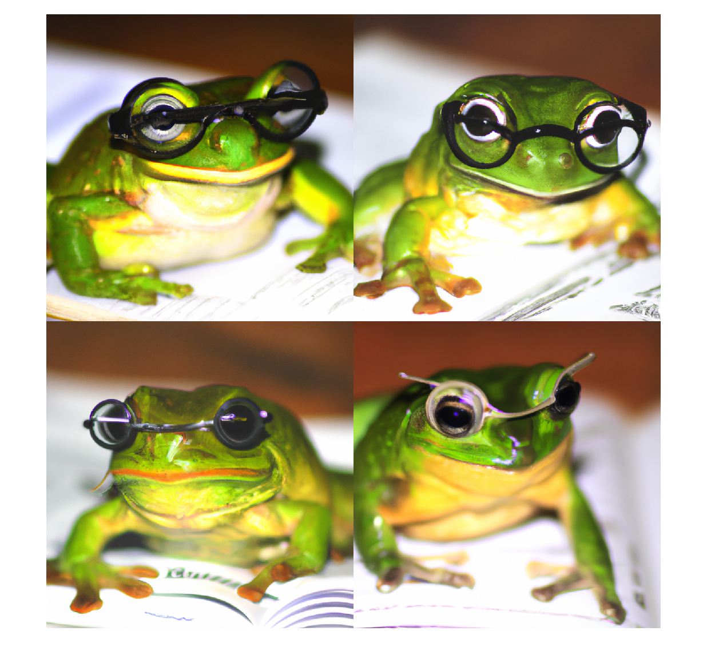

# createVariation

Generate image variations using DALL·E 2


`[imageVariation,httpResponse] = createVariation(model,image)`


`___ = createVariation(___,Name=Value)`

# Description

`[imageVariation,httpResponse] = createVariation(model,image)` generates variations from an image using the OpenAI® image generation model DALL·E 2.


`___ = createVariation(___,Name=Value)` specifies additional options using one or more name\-value arguments.

# Examples
## Generate Image Variations Using DALL·E 2

First, specify the OpenAI API key as an environment variable and save it to a file called `".env"`. Next, load the environment file using the `loadenv` function.

```matlab
loadenv(".env")
```

Connect to the OpenAI Images API. By default, the model is DALL·E 2.

```matlab
model = openAIImages
```

```matlabTextOutput
model = 
  openAIImages with properties:

    ModelName: "dall-e-2"
      TimeOut: 10

```

Generate and display an image based on a natural language prompt.

```matlab
frogImage = generate(model,"A small frog wearing spectacles.");
imshow(frogImage{1})
```



Save the image to a PNG (\*.png) file.

```matlab
imwrite(frogImage{1},"frog.png")
```

Create four different variations of the image.

```matlab
[imageVariations,httpResponse] = createVariation(model,"frog.png",NumImages=4)
```
| |1|
|:--:|:--:|
|1|1024x1024x3 uint8|
|2|1024x1024x3 uint8|
|3|1024x1024x3 uint8|
|4|1024x1024x3 uint8|

```matlabTextOutput
httpResponse = 
  ResponseMessage with properties:

    StatusLine: 'HTTP/1.1 200 OK'
    StatusCode: OK
        Header: [1x18 matlab.net.http.HeaderField]
          Body: [1x1 matlab.net.http.MessageBody]
     Completed: 0

```

Show the image variations in a montage.

```matlab
montage(imageVariations)
```


# Input Arguments
### `model` — Image generation model

`openAIImages` object


Image generation model, specified as an [`openAIImages`](openAIImages.md) object. The model name `model.ModelName` must be `"dall-e-2"`.

### `image` — Input image

string scalar | character vector


Input image, specified as a PNG (\*.png) file. The size of the image must be less than 4MB and the image must be square.

## Name\-Value Arguments
### `NumImages` — Number of images to generate

`1` (default) | positive integer less than or equal to `10`


Specify the number of images to generate. 

### `Size` — Size of generated image

`"1024x1024"` (default) | `"256x256"` | `"512x512"`


Size of the generated image in pixels.

# Output Argument
### `imageVariation` — Generated image variation

cell array of numerical matrices


Images that the model generates, returned as a cell array with `NumImages` elements. Each element of the cell array contains a generated image specified as an RGB images of size `Size`. For example, if you specify `Size="1024x1024"`, then the generated images have size `1024x1024x3`. 

### `httpResponse` — HTTP response message

`matlab.net.http.ResponseMessage` object


Response message returned by the server, specified as a [`matlab.net.http.ResponseMessage`](https://www.mathworks.com/help/matlab/ref/matlab.net.http.responsemessage-class.html) object.

# See Also

[`openAIImages`](openAIImages.md) | [`generate`](openAIImages.generate.md) | [`edit`](edit.md)

-  [Using DALL·E to Generate Images](../../examples/UsingDALLEToGenerateImages.md) 
-  [Using DALL·E to Edit Images](../../examples/UsingDALLEToEditImages.md) 

*Copyright 2024 The MathWorks, Inc.*

