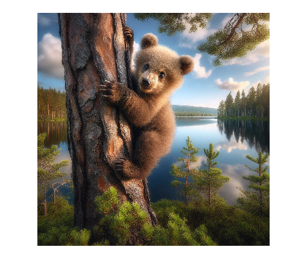
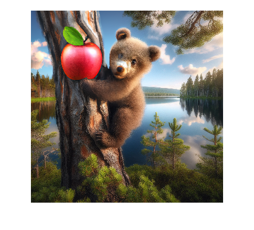

# edit

Edit images using DALL·E 2


`[editedImages,httpResponse] = edit(model,image,prompt)`


`___ = edit(___,Name=Value)`

# Description

Edit images using the OpenAI® image generation model DALL·E 2. 


Specify the area that you want to edit using a mask. The transparent areas of the mask, that is, anywhere that the mask is equal to zero, determine the parts of the source image that are edited. 


You can specify a mask using the `MaskImagePath` name\-value argument. If you do not specify a mask, then your input image must include a transparency layer. The function then uses the transparency as the mask.


`[editedImages,httpResponse] = edit(model,image,prompt)` edits an existing image using DALL·E 2 and a natural language prompt. 


`___ = edit(___,Name=Value)` specifies additional options using one or more name\-value arguments.

# Examples
## Edit Image Using DALL·E 2

First, specify the OpenAI® API key as an environment variable and save it to a file called `".env"`. Next, load the environment file using the `loadenv` function.

```matlab
loadenv(".env")
```

Connect to the OpenAI Images API. By default, the model is DALL·E 2.

```matlab
model = openAIImages;
```

Load and display the source image.

```matlab
imagePath = "llms-with-MATLAB/examples/images/bear.png";
figure
imshow(imagePath)
```



Create a mask to cover the top left of the image.

```matlab
mask = ones(1024,1024);
mask(1:512,1:512) = 0;
imwrite(mask,"topLeftMask.png");
```

Edit the image.

```matlab
[editedImages,httpResponse] = edit(model,imagePath,"Add a big red apple to the tree.",MaskImagePath="topLeftMask.png")
```

```matlabTextOutput
editedImages = 1x1 cell array
    {1024x1024x3 uint8}

httpResponse = 
  ResponseMessage with properties:

    StatusLine: 'HTTP/1.1 200 OK'
    StatusCode: OK
        Header: [1x18 matlab.net.http.HeaderField]
          Body: [1x1 matlab.net.http.MessageBody]
     Completed: 0

```

Display the new image.

```matlab
imshow(editedImages{1})
```


# Input Arguments
### `model` — Image generation model

`openAIImages` object


Image generation model, specified as an [`openAIImages`](openAIImages.md) object. The model name `model.ModelName` must be `"dall-e-2"`.

### `image` — Input image

string scalar | character vector


Input image, specified as a PNG (\*.png) file. The size of the image must be less than 4MB and the image must be square.


If you do not specify an editing mask, then the image must include a transparency dimension. The model will then use the transparency as the mask.


**Example**: `"myImageRepository/testImage.png"`

### `prompt` — User prompt

character vector | string scalar


Natural language prompt instructing the model what to do.


The user prompt must include fewer than or equal to 1000 characters.


**Example:** `"Please add an ice cream sundae to the picture."`

## Name\-Value Arguments
### `MaskImagePath` — Path to mask

string scalar | character vector


Mask, specified as a gray scale PNG (\*.png) file. The size of the mask must be less than 4MB and the mask must have the same dimensions as the input image.


The transparent areas of the mask, that is, anywhere that the mask is equal to zero, determine the parts of the source image to edit. 


If you do not specify a mask, then your input image must include a transparency dimension. The function then uses the transparency as the mask.

### `NumImages` — Number of images to generate

`1` (default) | positive integer less than or equal to 10


Specify the number of images to generate. 

### `Size` — Size of generated image

`"1024x1024"` (default) | `"256x256"` | `"512x512"`


Size of the generated image in pixels.

# Output Argument
### `editedImages` — Edited images

cell array of numerical matrices


Images that the model generates, returned as a cell array with `NumImages` elements. Each element of the cell array contains a generated image specified as an RGB image of the same size as the input image.

### `httpResponse` — HTTP response message

`matlab.net.http.ResponseMessage` object


Response message returned by the server, specified as a [`matlab.net.http.ResponseMessage`](https://www.mathworks.com/help/matlab/ref/matlab.net.http.responsemessage-class.html) object.

# See Also

[`openAIImages`](openAIImages.md) | [`generate`](openAIImages.generate.md) | [`createVariation`](createVariation.md)

-  [Using DALL·E to Generate Images](../../examples/UsingDALLEToGenerateImages.md) 
-  [Using DALL·E to Edit Images](../../examples/UsingDALLEToEditImages.md) 

*Copyright 2024 The MathWorks, Inc.*

