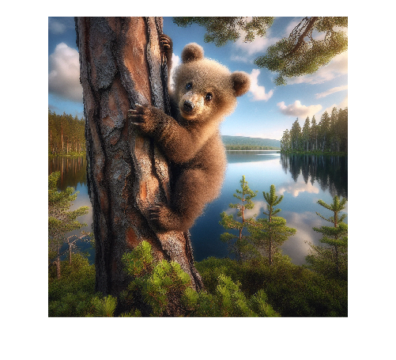
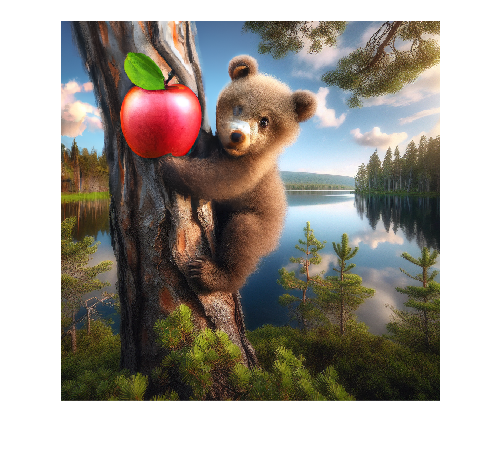

# edit

Edit images using OpenAI Images API


`[editedImages,httpResponse] = edit(model,image,prompt)`


`___ = edit(___,Name=Value)`

# Description

Edit images using the OpenAI® image generation API. 


Specify the area that you want to edit using a mask. The transparent areas of the mask, that is, anywhere that the mask is equal to zero, determine the parts of the source image that are edited. 


You can specify a mask using the `MaskImagePath` name\-value argument. If you do not specify a mask, then your input image must include a transparency layer. The function then uses the transparency as the mask.


`[editedImages,httpResponse] = edit(model,image,prompt)` edits an existing image using a natural language prompt. 


`___ = edit(___,Name=Value)` specifies additional options using one or more name\-value arguments.

# Examples
## Edit Image

First, specify the OpenAI® API key as an environment variable and save it to a file called `".env"`. Next, load the environment file using the `loadenv` function.

```matlab
loadenv(".env")
```

Connect to the OpenAI Images API.

```matlab
model = openAIImages(ModelName="gpt-image-1-mini");
```

Load and display the source image.

```matlab
imagePath = "llms-with-MATLAB/examples/images/bear.png";
figure
imshow(imagePath)
```



Create a mask to cover the top left of the image.

```matlab
mask = ones(1024,1024);
mask(1:512,1:512) = 0;
imwrite(mask,"topLeftMask.png");
```

Edit the image.

```matlab
[editedImages,httpResponse] = edit(model,imagePath,"Add a big red apple to the tree.",MaskImagePath="topLeftMask.png");
```

Display the new image.

```matlab
imshow(editedImages{1})
```


# Input Arguments
### `model` — Image generation model

`openAIImages` object


Image generation model, specified as an [`openAIImages`](openAIImages.md) object.

### `image` — Input image

string scalar | character vector


Input image, specified in a format that the model supports.


If you do not specify an editing mask, then the image must include a transparency dimension. The model will then use the transparency as the mask.


**Example**: `"myImageRepository/testImage.png"`

### `prompt` — User prompt

character vector | string scalar


Natural language prompt instructing the model what to do.

**Example:** `"Please add an ice cream sundae to the picture."`

## Name\-Value Arguments
### `MaskImagePath` — Path to mask

string scalar | character vector


Mask, specified as a gray scale image file. The mask must have the same size as the input image.


The transparent areas of the mask, that is, anywhere that the mask is equal to zero, determine the parts of the source image to edit. 


If you do not specify a mask, then your input image must include a transparency dimension. The function then uses the transparency as the mask.

### `NumImages` — Number of images to generate

`1` (default) | positive integer less than or equal to 10


Specify the number of images to generate. 

### `Size` — Size of generated image

`"auto"` (default) | `1024x1024` | `1536x1024` | `1024x1536`

Size of the generated image in pixels.

If you specify `Size` as `"auto"`, the software uses the default size of the model.

# Output Argument
### `editedImages` — Edited images

cell array of numerical matrices

Images that the model generates, returned as a cell array with `NumImages` elements. Each element of the cell array contains a generated image specified as an RGB image of the same size as the input image.

### `httpResponse` — HTTP response message

`matlab.net.http.ResponseMessage` object


Response message returned by the server, specified as a [`matlab.net.http.ResponseMessage`](https://www.mathworks.com/help/matlab/ref/matlab.net.http.responsemessage-class.html) object.

# See Also

[`openAIImages`](openAIImages.md) | [`generate`](openAIImages.generate.md) 

*Copyright 2024-2026 The MathWorks, Inc.*

