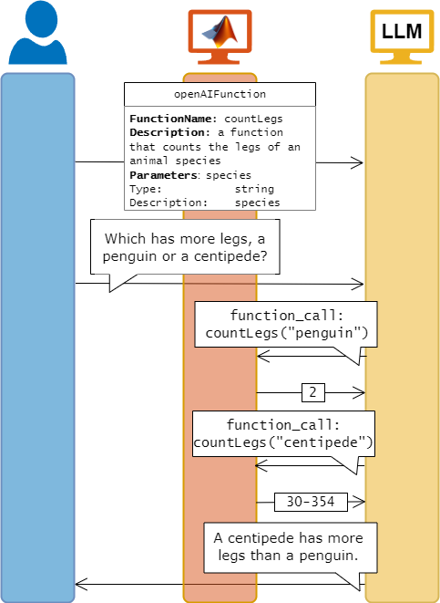
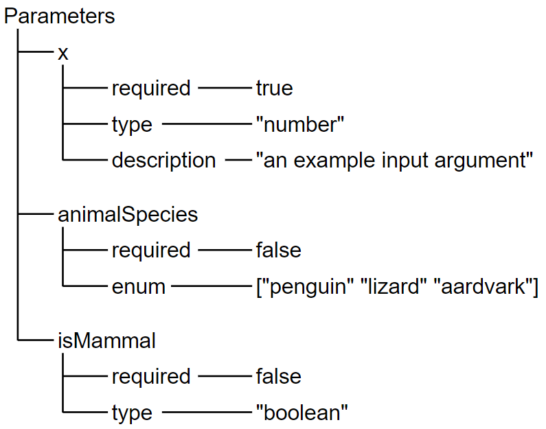

# openAIFunction

Use Function Calls from MATLAB®

# Creation
## Syntax

`f = openAIFunction(name,description)`

`f = openAIFunction(mcpTool)`

## Description

An `openAIFunction` object represents a tool that you have, such as a MATLAB function. It includes information about the name, syntax, and behavior of the tool. If you pass an `openAIFunction` object to a large language model (LLM), then the LLM can suggest calls to the tool in its generated output. The LLM does not execute the tool itself. However, you can write scripts that automate the tool calls suggested by the LLM.

If you have the [MATLAB MCP HTTP Client](https://www.mathworks.com/matlabcentral/fileexchange/182699-mcphttpclient) add\-on installed, then you can also use tools provided by external MCP servers.

Use `openAIFunction` objects to call tools using OpenAI® or Ollama™.


For example:





`f = openAIFunction(name,description)` creates an `openAIFunction` object with a name `name` and description `description`.

`f = openAIFunction(mcpTool)` creates an `openAIFunction` object from one or more tools provided by an MCP server specified as a cell array of struct. For example, `mcpTool = client.Tools` for an `mcpHTTPClient` object `client` (requires the [MATLAB MCP HTTP Client](https://www.mathworks.com/matlabcentral/fileexchange/182699-mcphttpclient) add\-on).

# Input Arguments
### `name` — Function name

character vector | string scalar


Specify the function name and set the `FunctionName` property.

### `description` — Function description

`[]` (default) | character vector | string scalar


Describe the function using natural language and set the `Description` property.

### `mcpTool` — Tool provided by MCP server
cell array of struct

Tool provided by an external MCP server, specified as a cell array of struct (requires the [MATLAB MCP HTTP Client](https://www.mathworks.com/matlabcentral/fileexchange/182699-mcphttpclient) add\-on).  

For example, if you have an `mcpHTTPClient` (MATLAB MCP HTTP Client) object `client`, then you can specify `mcpTool` as `client.Tools`.

# Properties
### `FunctionName` — Tool name

character vector | string scalar


This property is read\-only.


The name of your tool. This does not have to be the same as the name of your `openAIFunction` object.


Set this property at construction using the `name` input argument.

### `Description` — Tool description

`[]` (default) | character vector | string array


This property is read\-only.


Natural language description of your function. 


Set this property at construction using the `description` input argument.

### `Parameters` — Function arguments

empty structure array (default) | structure array


Each field corresponds to an input argument, specified as another structure array. Add parameters one\-by\-one using the `addParameter` function. The fields of the nested structure array depend on the input you provide to the `addParameter` function.

|      |      |      |
| :-- | :-- | :-- |
| Field name <br>  | Field description <br>  | Optional  <br>   |
| required <br>  | Whether the input argument is required, specified as `true` or `false`. <br>  | No <br>   |
| type <br>  | Data type or types of the input argument, specified as JSON data type. The possible argument types and their corresponding MATLAB data types are: <br> \-  `"string"` — character vector <br> \-  `"number"` — scalar double <br> \-  `"integer"` — scalar integer <br> \-  `"object"` — scalar structure <br> \-  `"boolean"` — scalar logical <br> \-  `"null"` — `NaN` or empty double <br> For more information on how to decode JSON\-formatted data in MATLAB, see [jsondecode](https://www.mathworks.com/help/matlab/ref/jsondecode.html). <br>  | Yes <br>   |
| description <br>  | Natural language description of the input argument, specified as a string or character array. <br>  | Yes <br>   |
| enum <br>  | List of all possible values of an input argument. <br>  | Yes <br>   |
|      |      |       |


For example, the `Parameters` structure describing the input arguments for a function `myFun(x)` with optional input arguments `animalSpecies` and `isMammal` could look like this:




# Object Functions

[`addParameter`](addParameter.md) — Add information about an input argument

# Examples
## Compute Sine Using OpenAI Function Call

First, specify the OpenAI® API key as an environment variable and save it to a file called `".env"`. Next, load the environment file using the `loadenv` function.

```matlab
loadenv(".env")
```

Create an `openAIFunction` object that represents the [`sind`](https://www.mathworks.com/help/matlab/ref/sind.html) function. The `sind` function has a single input argument, `x`, representing the input angle in degrees.

```matlab
f = openAIFunction("sind","Sine of argument in degrees");
f = addParameter(f,"x",type="number",description="Angle in degrees");
```

Connect to the OpenAI Chat Completion API. Pass the `openAIFunction` object `f` as an input argument.

```matlab
model = openAIChat("You are a helpful assistant.",Tools=f);
```

Initialize the message history. Add a user message to the message history.

```matlab
messages = messageHistory;
messages = addUserMessage(messages,"What is the sine of thirty?");
```

Generate a response based on the message history.

```matlab
[~,completeOutput] = generate(model,messages)
```

```matlabTextOutput
completeOutput = struct with fields:
          role: 'assistant'
       content: []
    tool_calls: [1x1 struct]
       refusal: []

```

The model has not generated any text. Instead, it has detected a function call, `completeOutput.tool_calls`.


Add the response to the message history.

```matlab
messages = addResponseMessage(messages,completeOutput);
```

Extract the tool call ID and the name of the called function.

```matlab
toolCallID = string(completeOutput.tool_calls.id)
```

```matlabTextOutput
toolCallID = "call_K4zqC0oO6vA97BTvSSCY9FHL"
```

```matlab
functionCalled = string(completeOutput.tool_calls.function.name)
```

```matlabTextOutput
functionCalled = "sind"
```

Make sure that the model is calling the correct function. Even with only a single function, large language models can hallucinate function calls to fictitious functions.


Extract the input argument values from the complete output using the [`jsondecode`](https://www.mathworks.com/help/matlab/ref/jsondecode.html) function. Compute the sine of the generated argument value and add the result to the message history using the `addToolMessage` function.

```matlab
if functionCalled == "sind"
    args = jsondecode(completeOutput.tool_calls.function.arguments);
    result = sind(args.x)
    messages = addToolMessage(messages,toolCallID,functionCalled,"x="+result);
end
```

```matlabTextOutput
result = 0.5000
```

Finally, generate a natural language response.

```matlab
generatedText = generate(model,messages)
```

```matlabTextOutput
generatedText = "The sine of thirty degrees is 0.5."
```
# See Also
-  [Analyze Scientific Papers Using ChatGPT Function Calls](../../examples/AnalyzeScientificPapersUsingFunctionCalls.md) 
-  [Analyze Text Data Using Parallel Function Calls with ChatGPT](../../examples/AnalyzeTextDataUsingParallelFunctionCallwithChatGPT.md)
-  [Analyze Text Data Using Parallel Function Calls with Ollama](../../examples/AnalyzeTextDataUsingParallelFunctionCallwithOllama.md) 
-  [Solve Simple Math Problem Using AI Agent](/examples/SolveSimpleMathProblemUsingAIAgent.md)
-  [Fit Polynomial to Data Using AI Agent](/examples/FitPolynomialToDataUsingAIAgentExample.md) (requires Curve Fitting Toolbox™)

*Copyright 2024 The MathWorks, Inc.*

