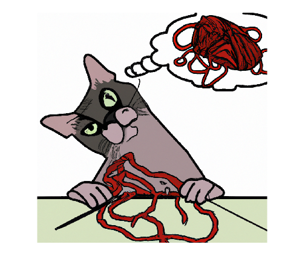

# generate

Generate image using OpenAI® image generation API


`[images,httpResponse] = generate(model,prompt)`


`___ = generate(___,Name=Value)`

# Description

`[images,httpResponse] = generate(model,prompt)` generates images from an OpenAI image generation model given a natural language prompt.


`___ = generate(___,Name=Value)` specifies additional options using one or more name\-value arguments.

# Examples
## Generate Image Using DALL·E 2

First, specify the OpenAI API key as an environment variable and save it to a file called `".env"`. Next, load the environment file using the `loadenv` function.

```matlab
loadenv(".env")
```

Connect to the OpenAI Images API. By default, the model is DALL·E 2.

```matlab
model = openAIImages
```

```matlabTextOutput
model = 
  openAIImages with properties:

    ModelName: "dall-e-2"
      TimeOut: 10

```

Generate and display an image based on a natural language prompt.

```matlab
catImage = generate(model,"An image of a cat confused by a complicated knitting pattern.");
imshow(catImage{1})
```


# Input Arguments
### `model` — Image generation model

`openAIImages` object


Image generation model, specified as an [`openAIImages`](openAIImages.md) object.

### `prompt` — User prompt

character vector | string scalar


Natural language prompt instructing the model what to do.


**Example:** `"Please draw a frog wearing spectacles."`

## Name\-Value Arguments
### `NumImages` — Number of images to generate

`1` (default) | positive integer


Specify the number of images to generate.


Generating more than one image at once is only supported for DALL·E 2.

### `Size` — Size of generated image

`"1024x1024"` (default) | `"256x256"` | `"512x512"` | `"1792x1024"` | `"1024x1792"`


Size of the generated image in pixels.


Sizes supported for DALL·E 2:

-  `"1024x1024"` 
-  `"256x256"` 
-  `"512x512"` 

Sizes supported for DALL·E 3:

-  `"1024x1024"` 
-  `"1024x1792"` 
-  `"1792x1024"` 
### `Quality` — Quality of generated image

`"standard"` (default) | `"hd"`


Specify the OpenAI `"quality"` parameter. This option is only supported for DALL·E 3.


If you specify the quality to be `"hd"`, then the cost per generated image increases.


For more information on the differences between standard and HD quality, see [https://cookbook.openai.com/articles/what\_is\_new\_with\_dalle\_3](https://cookbook.openai.com/articles/what_is_new_with_dalle_3).

### `Style` — Style of generated image

`"vivid"` (default) | `"natural"`


Specify the OpenAI `"style"` parameter. This option is only supported for DALL·E 3.


For more information on the differences between vivid and natural style, see [https://cookbook.openai.com/articles/what\_is\_new\_with\_dalle\_3](https://cookbook.openai.com/articles/what_is_new_with_dalle_3).

# Output Argument
### `images` — Generated images

cell array of numerical matrices


Images that the model generates, returned as a cell array with `NumImages` elements. Each element of the cell array contains a generated image specified as an RGB images of size `Size`. For example, if you specify `Size="1024x1024"`, then the generated images have size `1024x1024x3`. 

### `httpResponse` — HTTP response message

`matlab.net.http.ResponseMessage` object


Response message returned by the server, specified as a [`matlab.net.http.ResponseMessage`](https://www.mathworks.com/help/matlab/ref/matlab.net.http.responsemessage-class.html) object.

# See Also

[`openAIImages`](openAIImages.md) | [`edit`](edit.md) | [`createVariation`](createVariation.md)

-  [Using DALL·E to Generate Images](../../examples/UsingDALLEToGenerateImages.md) 
-  [Using DALL·E to Edit Images](../../examples/UsingDALLEToEditImages.md) 

*Copyright 2024 The MathWorks, Inc.*

