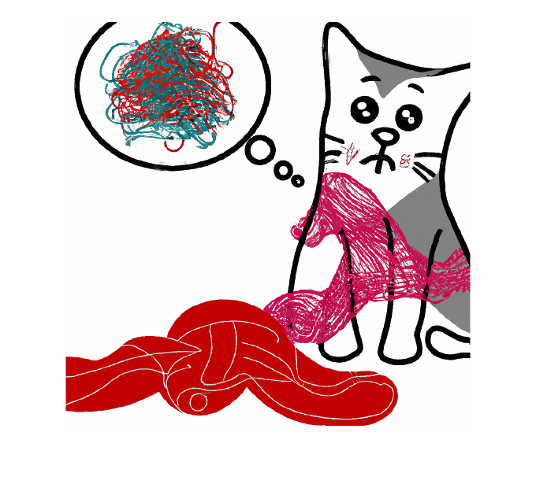

# openAIImages

Connect to OpenAI® Image Generation API from MATLAB®

# Creation
## Syntax

`model = openAIImages`


`model = openAIImages(___,APIKey=key)`


`model = openAIImages(___,Name=Value)`

## Description

Connect to the OpenAI Image Generation API to generate images using models developed by OpenAI.


To connect to the OpenAI API, you need a valid API key. For information on how to obtain an API key, see [https://platform.openai.com/docs/quickstart](https://platform.openai.com/docs/quickstart).


`model = openAIImages` creates an `openAIImages` object. Connecting to the OpenAI API requires a valid API key. Either set the environment variable `OPENAI_API_KEY` or specify the `APIKey` name\-value argument.


`model = openAIImages(___,APIKey=key)` uses the specified API key. 


`model = openAIImages(___,Name=Value)` specifies additional options using one or more name\-value arguments.

# Input Arguments
## Name\-Value Arguments
### `APIKey` — OpenAI API key

character vector | string scalar


OpenAI API key to access OpenAI APIs such as DALL·E. 


Instead of using the `APIKey` name\-value argument, you can also set the environment variable OPEN\_API\_KEY. For more information, see [OpenAI API](http://../OpenAI.md).

# Properties Settable at Construction

Optionally specify these properties at construction using name\-value arguments. Specify `PropertyName1=PropertyValue1,...,PropertyNameN=PropertyValueN`, where `PropertyName` is the property name and `PropertyValue` is the corresponding value.

### `ModelName` — Model name

`"dall-e-2"` (default) | `"dall-e-3"`


After construction, this property is read\-only.


Name of the OpenAI model to use for image generation. To use DALL·E 2, set `ModelName` to `"dall-e-2"`. To use DALL·E 3, set `ModelName` to `"dall-e-3"`.

### `TimeOut` — Connection timeout in seconds

`10` (default) | nonnegative numeric scalar


After construction, this property is read\-only.


If the OpenAI server does not respond within the timeout, then the function throws an error.

# Object Functions

[`generate`](openAIImages.generate.md) — Generate image using OpenAI image generation API


[`edit`](edit.md) — Edit images using DALL·E 2


[`createVariation`](createVariation.md) — Generate image variations using DALL·E 2

# Examples
## Generate Image Using DALL·E 2

First, specify the OpenAI API key as an environment variable and save it to a file called `".env"`. Next, load the environment file using the `loadenv` function.

```matlab
loadenv(".env")
```

Connect to the OpenAI Images API. By default, the model is DALL·E 2.

```matlab
model = openAIImages
```

```matlabTextOutput
model = 
  openAIImages with properties:

    ModelName: "dall-e-2"
      TimeOut: 10

```

Generate and display an image based on a natural language prompt.

```matlab
catImage = generate(model,"An image of a cat confused by a complicated knitting pattern.");
imshow(catImage{1})
```


# See Also

[`openAIChat`](openAIChat.md) | [`generate`](openAIImages.generate.md) | [`edit`](edit.md) | [`createVariation`](createVariation.md)

-  [Using DALL·E to Generate Images](../../examples/UsingDALLEToGenerateImages.md) 
-  [Using DALL·E to Edit Images](../../examples/UsingDALLEToEditImages.md) 

*Copyright 2024 The MathWorks, Inc.*

