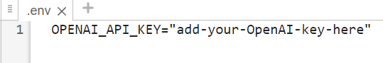
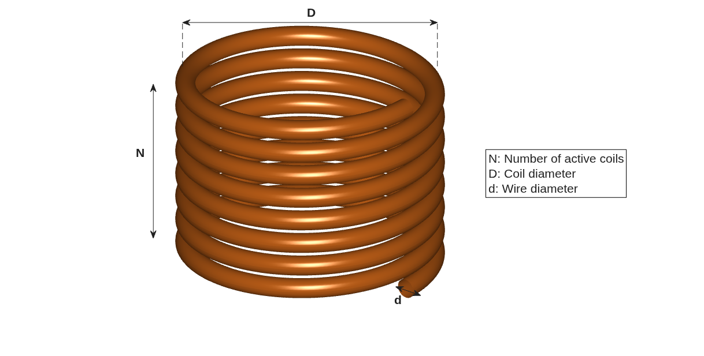

# Solve Optimization Problem Using ChatGPT

This example shows how to solve optimization problems in MATLAB® using ChatGPT™. 

- Build a prompt that describes an optimization problem to ChatGPT
- Generate code to solve the problem using ChatGPT
- Solve the problem and verify the solution

This example uses the Optimization Toolbox™ and Global Optimization Toolbox™.

# Setup

Using the OpenAI® API requires an OpenAI API key. For information on how to obtain an OpenAI API key, as well as pricing, terms and conditions of use, and information about available models, see the OpenAI documentation at [https://platform.openai.com/docs/overview](https://platform.openai.com/docs/overview).

To connect to the OpenAI API from MATLAB using LLMs with MATLAB, specify the OpenAI API key as an environment variable and save it to a file called ".env".



To connect to OpenAI, the ".env" file must be on the search path.

Load the environment file using the `loadenv` function.

```matlab
loadenv(".env")
```

# Describe Optimization Problem

The optimization problem in this example is a slightly modified version of the spring design problem in the following reference:

*Optimizing engineering designs using a combined genetic search, Deb, K., Goyal, M. Proceedings of the Seventh International Conference on Genetic Algorithms, 521\-528 (1997)*

This example involves the design of a helical compression spring.



Provide the LLM with three pieces of background information on compression springs.

 **Total number of coils:** This is equal to two plus the number of active coils, because the two end coils are used for stability, not compression. For more information, see the following reference:

[How to Count Spring Coils: Counting Active & Inactive Coils, Century Spring](https://www.centuryspring.com/resources/how-to-count-spring-coils?srsltid=AfmBOoos9siv9IVL_rNaMYZ29QnWgF6miGPhYKuFlDNsVqcX16zx0JrH)

**Spring index definition**: The ratio of coil diameter to wire diameter. Coils with higher spring indices are more flexible and tolerate lower loads. Also, it’s very difficult to manufacture springs with low spring indices.  

 **The compression spring is to act linearly under load:** The  *"Difference between spring deflection at maximum load and at applied load must be at least 1.25in."* constraint below ensures that the spring deflection is linearly dependent on the applied load.

Describe the optimization problem in natural language.

```matlab
problemDescription = ...
    "You want to design a helical compression spring." + newline + ...
    "The coil volume should be as small as possible." + newline + ...
    "You can decide on the number of coils in the spring, the diameter of the coil, and the wire diameter." + newline + ...
    "The spring can have no more than 32 coils." + newline + ...
    "You will apply a 300 lb load to the spring." + newline + ...
    "The spring can be no longer than 14 in." + newline + ...
    "The wire diameter must be no smaller than 0.2 in and no larger than 0.5 in." + newline + ...
    "The coil diameter must be no larger than 3 in." + newline + ...
    "The total diameter must be no bigger than 3 in." + newline + ...
    "The spring must not deflect more than 6 in." + newline + ...
    "The spring index must be at least 3." + newline + ...
    "Difference between spring deflection at maximum load and at applied load must be at least 1.25 in." + newline + ...
    "The shear stress must not exceed 0.12 Mpsi at the applied load." + newline + ...
    "The maximum shear stress of the material must not be exceeded at maximum load." + newline + ...
    "The coil volume must not exceed 30 in^3" + newline + ...
    "The modulus of rigidity is 11.5e6 psi." + newline + ...
    "The maximum shear stress of the material is 0.189e6 psi." + newline + ...
    "The maximum load of the material is 1000 lb.";
```

The coil constants are for ASTM A228 material.

# Specify Spring Functions

The `CoilSpringFunctions` folder contains several functions that calculate spring characteristics based on the coil constants and configuration. Add the folder to the path.

```matlab
projectDir = fileparts(which("openAIChat"));
functionFolderDir = fullfile(projectDir,"examples","mlx-scripts","CoilSpringFunctions");
addpath(functionFolderDir);
```

Now run a function to gather information about the functions. This will allow ChatGPT to generate code that correctly calls the functions. This helper function is defined in the **Supporting Functions** section at the bottom of this example.

```matlab
[functionFirstLines, functionInputStruct] = collectFunctionInfo(functionFolderDir);
```

This function also returns a structure where you can provide information on the input sizes. This sizes are all initialized to scalars, which matches the input sizes in this example. You can edit the structure manually for any future examples.

# Initialize ChatGPT

Read a system prompt into ChatGPT that includes advice on how to build OptimizationProblems in MATLAB.

```matlab
systemPromptFile = fullfile(functionFolderDir, "systemPrompt.md");
systemPrompt = strjoin(strip(readlines(systemPromptFile)), newline);
```

Create an LLM model that will help build the Optimization Problem in MATLAB.

```matlab
mdl = openAIChat(systemPrompt,ModelName="gpt-5.2");
```

# Ask ChatGPT to generate code to solve your Optimization Problem

Create a prompt from the problem description plus the function and data information.

```matlab
functionInputSizesString = string(jsonencode(functionInputStruct));
prompt = ...
    "The following functions are on the MATLAB path:" + newline + ...
    functionFirstLines + newline + newline + ...
    "The function inputs have the following sizes:" + newline + ...
    functionInputSizesString + newline + newline + ...
    "Formulate the following problem in MATLAB. Use the variable name coilProblem for the OptimizationProblem." + newline + ...
    problemDescription;
```

Now, ask ChatGPT to create code to solve the optimization problem

```matlab
problemCode = generate(mdl, prompt);
```

# Solve your Optimization Problem

To solve optimization problems in MATLAB, the [problem\-based workflow](https://www.mathworks.com/help/optim/ug/problem-based-workflow.html) is the recommended approach. The LLM has been instructed to produce problem\-based workflow code to solve the coil problem. Validate the code by reviewing it in a dialog, then run the code to solve the coil problem.

```matlab
[sol, fval, exitflag] = runGeneratedCodeWithApproval(problemCode)
```

```matlabTextOutput
Solving problem using ga.
ga stopped because the average change in the penalty function value is less than options.FunctionTolerance and 
the constraint violation is less than options.ConstraintTolerance.
sol = struct with fields:
    coilDiameter: 1.4981
        numCoils: 6
    wireDiameter: 0.2978


fval = 2.6224
exitflag = 
    SolverConvergedSuccessfully


```

# Verify the result

The `ga` function from the Global Optimization Toolbox was chosen automatically to solve the problem and it converged successfully to a solution. The best design returned from `solve` has the following properties:

- Number of coils (N): $6$
- Wire diameter (d): $0\ldotp 298\mathrm{in}$
- Coil diameter (D): $1\ldotp 498\mathrm{in}$
- Coil volume: ${2\ldotp 622\mathrm{in}}^3$

The best coil volume returned is slightly lower than that reported in Deb & Goyal. This is due to the fact the problem in this example has a continuous wire diameter rather than the discrete values in Deb & Goyal.

The output of LLMs is not guaranteed to be accurate. It is important to verify the solution to ensure it satisfies the requirements specified in the problem description. To illustrate this, check the deflection requirement by evaluating `coilDeflection` at the solution

*The spring must not deflect more than 6 in.*

```matlab
maxLoad = 1000;
modulusOfRigidity = 11.5e6;
coilDeflection(sol.numCoils, sol.wireDiameter, sol.coilDiameter, maxLoad, modulusOfRigidity)
```

```matlabTextOutput
ans = 1.7845
```

The coil deflection (1.7845`in`) meets the requirement at the solution.

# Supporting Functions

## Describe Function Syntax

Define a local function named `collectFunctionInfo` that returns the API of any MATLAB functions and a structure containing function input sizes. The function accepts the directory containing the functions as input.

```matlab
function [funInfo, inputSizeStruct] = collectFunctionInfo(functionDir)


% Find all MATLAB functions in problem directory
MATLABFunctions = dir(fullfile(functionDir, "*.m"));
numFiles = numel(MATLABFunctions);
funStrings = strings(1, numFiles);
funInputs = cell(1, numFiles);
for i = 1:numFiles
    thisFile = readlines(fullfile(MATLABFunctions(i).folder, MATLABFunctions(i).name));
    funStrings(i) = extractAfter(thisFile(1), "function ");
    funInputs{i} = extractBetween(funStrings(i), "(", ")");
    funInputs{i} = strip(strsplit(funInputs{i}, ","));
end
funInfo = join(funStrings, newline);


% Next, build the input size substructure
funInputs = unique([funInputs{:}]);
for i = 1:numel(funInputs)
    inputSizeStruct.(funInputs{i}) = [1 1];
end
end
```

## Request Approval and Evaluate LLM\-Generated Code

Create a dialog that displays the code to create an `OptimizationProblem` that ChatGPT generated and requests user approval to run the code. If approved, evaluate the code.

This function accepts the generated code, and the constants that will be used when the code is evaluated.

```matlab
function [sol, fval, exitflag] = runGeneratedCodeWithApproval(code, modulusOfRigidity, maxShearStress, maxLoad)
code = extractBetween(code, "```matlab", "```");
figurename = "Review Code Generated by LLM";
fig = uifigure(WindowStyle="modal",Name=figurename,UserData=struct("Approved",false));
fig.Position([3 4]) = [1000 750];
movegui(fig,"center")
gridLayout = uigridlayout(fig,RowHeight=["fit" "1x" "fit" "fit"],ColumnWidth=["1x" "fit" "fit"]);
label1 = uilabel(gridLayout,Text="The third-party LLM you selected generated the following code:");
label1.Layout.Row = 1;
label1.Layout.Column = [1 3];
codeBox = uitextarea(gridLayout,Value=code,WordWrap="off",Editable="off",FontName="Monospaced");
codeBox.Layout.Row = 2;
codeBox.Layout.Column = [1 3];
label2 = uilabel(gridLayout,Text="MATLAB cannot guarantee the accuracy or security " + ...
    "of code generated from a third-party AI model.",FontAngle="italic");
label2.Layout.Row = 3;
label2.Layout.Column = [1 3];
uilabel(gridLayout,Text="Do you want to run this code in MATLAB?",FontWeight="bold");
uibutton(gridLayout,Text="Run Code",ButtonPushedFcn=@(btn,evt) setApproved(fig,true));
uibutton(gridLayout,Text="Cancel",ButtonPushedFcn=@(btn,evt) setApproved(fig,false));
uiwait(fig);
approved = fig.UserData.Approved;
delete(fig);
if approved
    eval(code)
else
    error("Running the generated code was canceled.")
end
end
```

Record whether the user approved or did not approve running the generated code.

```matlab
function setApproved(fig,approvalStatus)
fig.UserData.Approved = approvalStatus;
uiresume(fig);
end
```

# Using AI Agents

This example use a one shot call to ChatGPT to generate MATLAB code. If your workflow is too complicated for this approach, then you can build and use an AI agent. For an example of building an AI agent, see [Solve Simple Math Problem Using AI Agent](https://github.com/matlab-deep-learning/llms-with-matlab/blob/main/examples/SolveSimpleMathProblemUsingAIAgent.md).

*Copyright 2026 The MathWorks, Inc.*