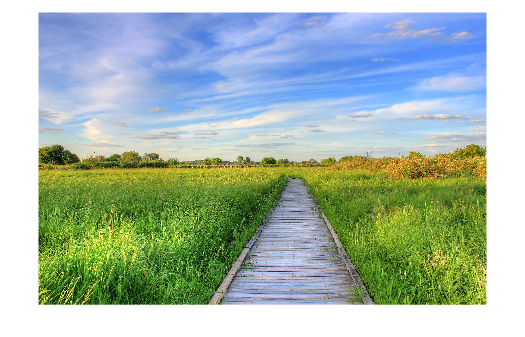

# Describe Images Using ChatGPT™

To run the code shown on this page, open the MLX file in MATLAB®: [mlx-scripts/DescribeImagesUsingChatGPT.mlx](mlx-scripts/DescribeImagesUsingChatGPT.mlx) 

This example shows how to generate image descriptions using the addUserMessageWithImages function. To run this example, you need a valid API key from a paid OpenAI™ API account, and a history of successful payment.

```matlab
loadenv(".env")
addpath('../..')
```
# Load and Display Image Data

Load the sample image from Wikipedia. Use the `imread` function to read images from URLs or filenames.

```matlab
image_url = 'https://upload.wikimedia.org/wikipedia/commons/thumb/d/dd/Gfp-wisconsin-madison-the-nature-boardwalk.jpg/2560px-Gfp-wisconsin-madison-the-nature-boardwalk.jpg';
im = imread(image_url);
imshow(im)
```


# Generate Image Descriptions

Ask questions about the image with the URL.

```matlab
chat = openAIChat("You are an AI assistant."); 
```

Create a message and pass the image URL along with the prompt.

```matlab
messages = messageHistory;
messages = addUserMessageWithImages(messages,"What is in the image?", string(image_url));
```

Generate a response.

```matlab
[txt,~,response] = generate(chat,messages);
if response.StatusCode == "OK"
    wrappedText = wrapText(txt)
else
    response.Body.Data.error
end
```

```matlabTextOutput
wrappedText = 
    "The image depicts a scenic outdoor landscape featuring a wooden pathway or 
     boardwalk extending through a lush green field. The field is filled with tall 
     grass and bordered by greenery, including trees and shrubbery. Above, the sky 
     is bright and cloudy, creating a serene and tranquil atmosphere."

```
# Helper function
```matlab
function wrappedText = wrapText(text)
    s = textwrap(text,80);
    wrappedText = string(join(s,newline));
end
```

*Copyright 2024 The MathWorks, Inc.*

