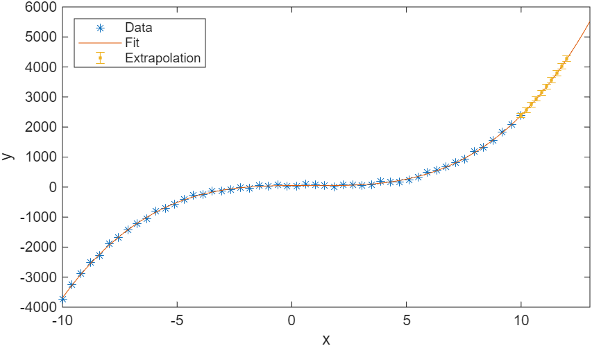
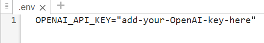
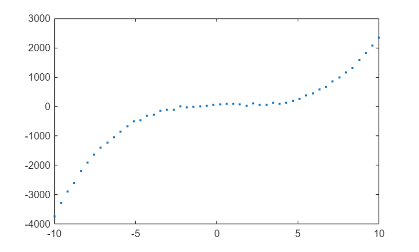
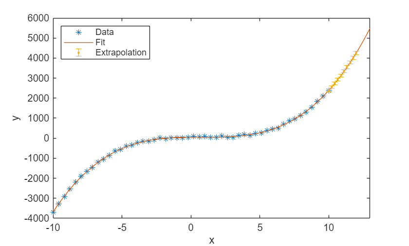

# Fit Polynomial to Data Using AI Agent

To run the code shown on this page, open the MLX file in MATLAB®: [mlx-scripts/FitPolynomialToDataUsingAIAgentExample.mlx](mlx-scripts/FitPolynomialToDataUsingAIAgentExample.mlx) 

This example shows how to build an AI agent to fit polynomials up to ninth degree to data and choose the best fit.


This example uses: 

-  LLMs with MATLAB v4.5.0 
-  Curve Fitting Toolbox™ 

AI agents are programs that autonomously plan and execute workflows. Typically, agents use large language models (LLMs) to process user queries and identify actions that need to be taken, also known as *tool calls*. The agent executes the tool calls that the LLM has identified and returns the result to the LLM. Then, the LLM generates an answer or executes more tool calls.


The agent implemented in this example uses a ReAct architecture \[1\]. This architecture is an iterative workflow. At each step, the agent decides whether to reason in natural language or to invoke a tool call, until the agent generates a final answer. For an example of building a ReAct agent to solve a simple math problem, see [Solve Simple Math Problem Using AI Agent](https://github.com/matlab-deep-learning/llms-with-matlab/blob/main/examples/SolveSimpleMathProblemUsingAIAgent.md).


In this example, the ReAct agent finds the best polynomial fit following these steps:

1.  Fit the data to polynomials with degrees 1 to *N* using the [`fit`](https://www.mathworks.com/help/curvefit/fit.html) function. The agent chooses *N* based on the user prompt. Save models and goodness\-of\-fit statistics.
2. Evaluate the different fits. The agent has several tools to assess the fits. The agent chooses which assessment tools to call in what order.
3. Choose the best fit.

To make the workflow more robust, deterministic parts of the process, such as preprocessing data or plotting the final result, are not part of the agentic loop.




# Set Up Connection to OpenAI API

This example uses the OpenAI® API, which requires an OpenAI API key. For information on how to obtain an OpenAI API key, as well as pricing, terms and conditions of use, and information about available models, see the OpenAI documentation at [https://platform.openai.com/docs/overview](https://platform.openai.com/docs/overview).


To connect to the OpenAI API from MATLAB® using LLMs with MATLAB, specify the OpenAI API key as an environment variable and save it to a file called ".env".





To connect to OpenAI, the ".env" file must be on the search path. Load the environment file using the [`loadenv`](https://www.mathworks.com/help/matlab/ref/loadenv.html) function.

```matlab
loadenv(".env")
```
# Create Data

Generate data points. First, create a third\-order polynomial. Then, add some random noise to the data. Finally, plot the data.

```matlab
nData = 50;
x = linspace(-10,10,nData)';
a = 3;
b = -7;
c = 4;
d = 2;
y = a*(x).^3 + b*(x).^2 + c*x + d;
y = y + 100*rand(size(y));

figure
plot(x,y,'.')
```



Not all MATLAB datatypes can be easily expressed in a form that can be passed to or from an LLM (for example, complex numbers or polynomial fit datatypes). Large arrays may also degrade performance and increase cost. Instead of sending such raw data, keep it as internal state within the agent. To do this, store the values in a `data` structure that is passed into and updated by the functions defined below.

```matlab
data.x = x;
data.y = y;
```
# Define Tools

To enable the LLM to make tool calls, define an `openAIFunction` object for each tool. You can then pass the tools to the LLM by specifying the `Tools` name\-value argument of the [`openAIChat`](../doc/functions/openAIChat.md) function.


For examples of how to use tool calling with the Large Language Models (LLMs) with MATLAB add\-on, see:

-  [Analyze Scientific Papers Using ChatGPT Function Calls](https://github.mathworks.com/development/llms-with-matlab/blob/main/examples/AnalyzeScientificPapersUsingFunctionCalls.md) 
-  [Analyze Text Data Using Parallel Function Calls with ChatGPT](https://github.mathworks.com/development/llms-with-matlab/blob/main/examples/AnalyzeTextDataUsingParallelFunctionCallwithChatGPT.md) 

In this example, use an LLM to fit polynomials to data. Give the agent access to four tools:

-  Fit polynomials of up to the highest potential degree to the data. Save the models and goodness\-of\-fit statistics. 
-  Generate extrapolated plots of the polynomial fits. Use a vision model to assess the extrapolated fits. 
-  Analyze and assess the goodness\-of\-fit statistics. 
-  Analyze and assess the overfitting statistics. 
## Fit Polynomials to Data

First, to keep track of the different potential polynomial fits, add information about potential polynomial degrees to the `data` structure using the `initializeCandidatePolynomialDegrees` function.

```matlab
function data = initializeCandidatePolynomialDegrees(data,maxDegree)
    data.polynomials.Degree = 1:maxDegree;
    data.polynomials.IsCandidateFit = true(1,maxDegree);
end
```

Next, fit polynomials of each degree to the data and add the resulting models and goodness\-of\-fit statistics to the `data.polynomials` structure using the `computeCandidatePolynomials` function. 


To help the agent understand the function output, return a natural language description, `observation`, in addition to the updated `data` structure.

```matlab
function [data,observation] = computeCandidatePolynomials(data)
polynomialDegrees = data.polynomials.Degree;
observation = "";
if any(polynomialDegrees >= 10)
    polynomialIsSupported = polynomialDegrees < 10;
    data.polynomials = data.polynomials(polynomialIsSupported,:);
    observation = "The fit function does not support polynomials with degrees greater than 9.";
end
for i = 1:numel(polynomialDegrees)
    fitType = "poly" + polynomialDegrees(i);
    
    [fittedModel,gof] = fit(data.x,data.y,fitType,Normalize="on");

    data.polynomials.FittedModel{i} = fittedModel;
    data.polynomials.GOF{i} = gof;
end
observation = observation + "Polynomials of up to degree " + max(polynomialDegrees) + " fitted successfully.";
end
```

The agent must call these two functions in order. Create a wrapper function called `fitPolynomialsToData` that first calls `initializeCandidatePolynomialDegrees` and then calls `computeCandidatePolynomials`.

```matlab
function [data,observation] = fitPolynomialsToData(data,maxDegree)
data = initializeCandidatePolynomialDegrees(data,maxDegree);
[data,observation] = computeCandidatePolynomials(data);
end
```

Finally, create an `openAIFunction` object that represents the `fitPolynomialsToData` function. 

```matlab
toolFitPolynomialsToData = openAIFunction("fitPolynomialsToData","Fit polynomials of up to a given maximum degree to data. Save the models and goodness-of-fit statistics.");
toolFitPolynomialsToData = addParameter(toolFitPolynomialsToData,"maxDegree",type="number",description="Maximum polynomial degree");
```
## Reject Statistically Unstable Polynomial Fits

Use confidence bounds on coefficients to help you evaluate and compare fits. If the confidence bounds cross zero for a coefficient, this means you cannot be sure that it differs from zero. Therefore, reject fits with leading coefficients that have confidence bounds that cross zero.


The `rejectZeroCrossFits` function checks each polynomial fit to determine whether the confidence bounds on the highest order coefficient cross zero. If they do, then the function rejects the fit.

```matlab
function [data,observation] = rejectZeroCrossFits(data)
polynomialDegrees = data.polynomials.Degree;
polynomialHasUnstableCoefficient = false(size(polynomialDegrees));
% Only analyze polynomials that have not already been rejected by other assessment tools
for i = polynomialDegrees(data.polynomials.IsCandidateFit)
    confidenceIntervals = confint(data.polynomials.FittedModel{i});
    polynomialHasUnstableCoefficient(i) = (confidenceIntervals(1,1) <= 0) & (confidenceIntervals(2,1) >= 0);
end
data.polynomials.IsCandidateFit = data.polynomials.IsCandidateFit & ~polynomialHasUnstableCoefficient;
log = sprintf("Rejected degrees %s. The confidence bounds of the leading coefficient crossed zero, indicating unstable fits.", ...
    jsonencode(polynomialDegrees(polynomialHasUnstableCoefficient)));
observation = "Remaining degrees: " + jsonencode(polynomialDegrees(data.polynomials.IsCandidateFit)) + newline + "Log: " + log;
end
```

Create an `openAIFunction` object that represents the `rejectZeroCrossFits` function. To help the agent understand the purpose of the tool, provide a description.

```matlab
toolRejectZeroCrossFits = openAIFunction("rejectZeroCrossFits", ...
    "Assess the statistical stability of polynomial fits by determining whether the confidence bounds of the leading coefficients cross zero.");
```
## Inspect Plots of Polynomial Fits Using Vision Model

The `visuallyInspectPlotsOfPolynomialFits` function generates extrapolated plots of the polynomial fits and saves them to a temporary directory using the `createAndSaveExtrapolatedFitPlot` function, defined at the bottom of this example. The function then uses an LLM able to understand images, GPT\-4.1 mini, to look at all of the plots and reject fits that look unreasonable. 


The function uses structured outputs to obtain a list of unrejected polynomial degrees from the LLM. For more information on structured outputs, see [Structured Output](../doc/OpenAI.md).

```matlab
function [data,observation] = visuallyInspectPlotsOfPolynomialFits(data)
polynomialDegrees = data.polynomials.Degree;
% Create temporary directory in which to save fit plots.
tempDirectory = tempname(pwd);
mkdir(tempDirectory);
cleanupObj = onCleanup(@() rmdir(tempDirectory,"s"));

% Create and save plots, then add them to the message history.
messages = messageHistory;
for i = 1:length(polynomialDegrees)
    imgName = createAndSaveExtrapolatedFitPlot(data,polynomialDegrees(i),tempDirectory);   
    messages = addUserMessageWithImages(messages,"Polynomial degree " + polynomialDegrees(i),imgName);
end

% Use vision model to assess the plots.
responseFormat = struct("rationale","Example rationale","isVisuallyReasonable",[1 2]);
visionModel = openAIChat("You are a curve fitting expert, receiving plots of different polynomial fits of the same data. " + ...
    "Check whether the fits look reasonable and reject those that do not.", ...
    ModelName="gpt-4.1-mini",ResponseFormat=responseFormat);
[structResponse,~,httpResponse] = generate(visionModel,messages);
if httpResponse.StatusCode ~= "OK"
    error("OpenAI request failed: %s",jsonencode(httpResponse.Body.Data.error));
end
isVisuallyReasonable = ismember(data.polynomials.Degree,structResponse.isVisuallyReasonable);
data.polynomials.IsCandidateFit = data.polynomials.IsCandidateFit & isVisuallyReasonable;
observation = "Remaining degrees: " + jsonencode(polynomialDegrees(data.polynomials.IsCandidateFit)) + newline + "Rationale: " + wrapText(structResponse.rationale);
end
```

Create an `openAIFunction` object that represents the `visuallyInspectPlotsOfPolynomialFits` function. To help the agent understand the purpose of the tool, provide a description.

```matlab
toolVisuallyInspectPlotsOfPolynomialFits = openAIFunction("visuallyInspectPlotsOfPolynomialFits", ...
    "Given a list of polynomial degrees, generate plots of the data beyond the data range. Inspect the generated plots using a vision model. " + ...
    "Discard visually unreasonable fits, return remaining list of degrees.");
```
## Assess Goodness\-of\-Fit Statistics

The `checkGoodnessOfFit` function evaluates the quality of each polynomial fit using goodness\-of\-fit statistics:

-  `adjrsquare` — Degree\-of\-freedom adjusted coefficient of determination.  
-  `sse` — Sum\-of\-squares error. 

First, the function rejects fits with a small `adjrsquare` or a very large `sse`, which both indicate underfitting.


Second, the function rejects fits that do not show significant improvement in either `adjrsquare` or `sse` compared to fits with lower\-degree polynomials.

```matlab
function [data,observation] = checkGoodnessOfFit(data)
polynomialDegrees = data.polynomials.Degree;

[sse,adjustedRSquare] = extractGOFFromData(data);
[isPoorFit,logPoorFit] = identifyPoorFits(polynomialDegrees,sse,adjustedRSquare); 
[isNotImproving,logNoImprovement] = identifyNotImproving(polynomialDegrees,sse,adjustedRSquare);

data.polynomials.IsCandidateFit = data.polynomials.IsCandidateFit & ~isPoorFit & ~isNotImproving;
observation = "Remaining degrees: " + jsonencode(polynomialDegrees(data.polynomials.IsCandidateFit)) + newline + "Log: " + ...
    newline + logPoorFit + newline + logNoImprovement;
end
```

Create an `openAIFunction` object that represents the `checkGoodnessOfFit` function. To help the agent understand the purpose of the tool, provide a description.

```matlab
toolCheckGoodnessOfFit = openAIFunction("checkGoodnessOfFit",...
    "Given a list of polynomial degrees, check their goodness-of-fit statistics, namely SSE and Adjusted R-squared, to"+... 
    "discard unreasonable fits.");
```
## Register to Tool Registry

To enable structured and scalable usage of multiple tools, store both the `openAIFunction` objects and their corresponding MATLAB function handles in a dictionary `toolRegistry`.

```matlab
toolRegistry = dictionary;
toolRegistry("fitPolynomialsToData") = struct(...
    'functionHandle',@fitPolynomialsToData,...
    'toolSpecification',toolFitPolynomialsToData);
toolRegistry("visuallyInspectPlotsOfPolynomialFits") = struct(...
    'functionHandle',@visuallyInspectPlotsOfPolynomialFits,...
    'toolSpecification',toolVisuallyInspectPlotsOfPolynomialFits);
toolRegistry("checkGoodnessOfFit") = struct(...
    'functionHandle',@checkGoodnessOfFit,...
    'toolSpecification',toolCheckGoodnessOfFit);
toolRegistry("rejectZeroCrossFits") = struct(...
    'functionHandle',@rejectZeroCrossFits,...
    'toolSpecification',toolRejectZeroCrossFits);
```
# Use Agent to Find Best Fit

Define the query. Answer the query using a ReAct agent. The agent returns a structured output with the best polynomial degree and the updated data structure.

```matlab
userQuery = "Fit a polynomial to the data. Try up to ninth degree, then choose the best one.";
responseFormat = struct("bestDegree",5);
[agentResponse,data] = runReActAgent(userQuery,toolRegistry,data,responseFormat);
```

```matlabTextOutput
User: Fit a polynomial to the data. Try up to ninth degree, then choose the best one.

[Thought] I will fit polynomials of degrees 1 to 9 to the data, saving the models and 
goodness-of-fit statistics for each.

[Action] Calling tool 'fitPolynomialsToData' with args: {"maxDegree":9}

[Observation] Result from tool 'fitPolynomialsToData': Polynomials of up to degree 9 fitted successfully.

[Thought] I will visually inspect the plots of the polynomial fits to discard any 
visually unreasonable fits.

[Action] Calling tool 'visuallyInspectPlotsOfPolynomialFits'

[Observation] Result from tool 'visuallyInspectPlotsOfPolynomialFits': Remaining degrees: [3,4,5,6]
Rationale: The polynomial fits of degree 1 and 2 do not capture the trend of 
the data 
well; the fits deviate significantly from the data points and miss key 
inflection points. Starting from degree 3, the fit starts capturing the data 
trend more accurately. Degrees 3 to 6 show smooth fits closely following the 
data without unreasonable oscillations, indicating a good balance between bias 
and variance. However, degrees 7, 8, and especially 9 introduce large 
oscillations and extreme values outside the data range, suggesting overfitting 
and instability at the domain edges. Therefore, fits with degrees 7, 8, and 9 
should be rejected due to overfitting and lack of visual reasonableness. Fits 
of degrees 3, 4, 5, and 6 are visually reasonable.

[Thought] I will check the goodness-of-fit statistics (SSE and Adjusted R-squared) for 
the polynomial fits of degrees 3, 4, 5, and 6 to further narrow down the best 
polynomial degree.

[Action] Calling tool 'checkGoodnessOfFit'

[Observation] Result from tool 'checkGoodnessOfFit': Remaining degrees: 3
Log: 
Step 1: Reject degrees [1,2] due to low adjusted R2.
Step 2: Reject degrees [1,2] due to very high SSE.
Step 3: Reject degrees [4,5,6,7,8,9] as higher-order terms failed to improve 
adjR2 or SSE.

[Thought] I will assess the statistical stability of the polynomial fit of degree 3 by 
checking whether the confidence bounds of the leading coefficients cross zero 
to confirm the model's reliability.

[Action] Calling tool 'rejectZeroCrossFits'

[Observation] Result from tool 'rejectZeroCrossFits': Remaining degrees: 3
Log: Rejected degrees []. The confidence bounds of the leading coefficient 
crossed zero, indicating unstable fits.

[Thought] The best polynomial fit is of degree 3, as it passed visual inspection, 
goodness-of-fit checks, and statistical stability tests. I will call the 
finalAnswer tool with this result.
```

```matlab
bestDegree = agentResponse.bestDegree
```

```matlabTextOutput
bestDegree = 3
```

# Plot Fit

View the fitted model that the agent returned.

```matlab
bestDegreeIndex = find(data.polynomials.Degree == bestDegree);
fittedModel = data.polynomials.FittedModel{bestDegreeIndex}
```

```matlabTextOutput
fittedModel = 
     Linear model Poly3:
     fittedModel(x) = p1*x^3 + p2*x^2 + p3*x + p4
       where x is normalized by mean -2.309e-16 and std 5.95
     Coefficients (with 95% confidence bounds):
       p1 =       630.9  (619.8, 641.9)
       p2 =      -249.1  (-258.7, -239.5)
       p3 =       23.13  (1.871, 44.39)
       p4 =       51.96  (39.34, 64.57)
```


Plot the polynomial fit returned by the agent.

```matlab
xExtrapolated = linspace(max(data.x),max(data.x)+range(data.x)/10,10);
populationExtrapolated = fittedModel(xExtrapolated);
confidenceInterval = predint(fittedModel,xExtrapolated,0.95,'observation');

figure
plot(data.x,data.y,'*')
xlim([min(data.x),1.3*max(data.x)])
hold on
fig = plot(fittedModel);
set(fig,'linewidth',0.5)
h = errorbar(xExtrapolated,populationExtrapolated,populationExtrapolated-confidenceInterval(:,1),confidenceInterval(:,2)-populationExtrapolated,'.');
hold off
legend("Data","Fit","Extrapolation",Location='northwest');
```


# Helper Functions
## ReAct Agent

The `runReActAgent` function answers a user query using the ReAct agent architecture \[1\] and the tools provided in `toolRegistry`. For more information on creating a ReAct agent architecture in MATLAB, see [Solve Simple Math Problem Using AI Agent](https://github.com/matlab-deep-learning/llms-with-matlab/blob/main/examples/SolveSimpleMathProblemUsingAIAgent.md).

```matlab
function [agentResponse,data] = runReActAgent(userQuery,toolRegistry,data,responseFormat)
arguments
    userQuery
    toolRegistry
    data
    responseFormat = "text"
end
systemPrompt = "You are an AI agent solving problems in MATLAB. After you have solved the problem, " + ...
    "call the tool 'finalAnswer' or else you will get stuck in a loop. Do not use Markdown.";

% Define exit mechanism with a final answer tool
toolFinalAnswer = openAIFunction("finalAnswer","Call this tool when you have reached the final answer.");
tools = [toolRegistry.values.toolSpecification toolFinalAnswer];

% Initialize the LLM
llm = openAIChat(systemPrompt,ModelName="gpt-4.1-mini",Tools=tools);
history = messageHistory;

fprintf('User: %s\n\n',wrapText(userQuery));
history = addUserMessage(history,userQuery);
maxSteps = 20;
stepCount = 0;
problemSolved = false;
while ~problemSolved
    if stepCount >= maxSteps
        error("Agent stopped after reaching maximum step limit (%d).",maxSteps);
    end
    stepCount = stepCount + 1;

    % Thought
    history = addUserMessage(history,"Plan your single next step concisely.");
    [thought,completeOutput] = generate(llm,history,ToolChoice="none");
    fprintf("[Thought] %s\n\n",wrapText(thought));
    history = addResponseMessage(history,completeOutput);

    % Action
    history = addUserMessage(history,"Call tools to solve the problem.");
    [~,completeOutput] = generate(llm,history,ToolChoice="required");
    history = addResponseMessage(history,completeOutput);
    actions = completeOutput.tool_calls;
    if isscalar(actions) && strcmp(actions(1).function.name,"finalAnswer")
        history = addToolMessage(history,actions.id,"finalAnswer","Final answer below");
        history = addUserMessage(history,"Return the final answer concisely.");
        agentResponse = generate(llm,history,ResponseFormat=responseFormat);
        problemSolved = true;
    else
        for i = 1:numel(actions)
            action = actions(i);
            toolName = action.function.name;
            jsonArgs = action.function.arguments;
            actionLog = sprintf("[Action] Calling tool '%s'",toolName);
            if ~strcmp(jsonArgs,'{}')
                actionLog = actionLog + sprintf(" with args: %s",jsonArgs);
            end
            fprintf("%s\n\n",actionLog);
            % Observation
            [data,observation] = evaluateToolCall(action,toolRegistry,data);
            fprintf("[Observation] Result from tool '%s': %s\n\n",toolName,wrapText(observation));
            history = addToolMessage(history,action.id,toolName,"Observation: " + observation);
        end
    end
end
end
```
## Evaluate Tool Calls

The `evaluateToolCall` function evaluates tool calls identified by the LLM. LLMs can hallucinate tool calls or make errors about the parameters that the tools need. Therefore, first validate the tool name and parameters by comparing them to the `toolRegistry` dictionary. Then, run the functions associated with the tools.

```matlab
function [data,observation] = evaluateToolCall(toolCall,toolRegistry,data)
% Validate tool name
toolName = toolCall.function.name;
assert(isKey(toolRegistry,toolName),"Invalid tool name '%s'.",toolName)

% Validate JSON syntax
try
    args = jsondecode(toolCall.function.arguments);
catch
    error("Model returned invalid JSON syntax for arguments of tool '%s'.",toolName);
end

% Validate tool parameters
toolSpec = toolRegistry(toolName);
requiredArgs = string(fieldnames(toolSpec.toolSpecification.Parameters));
assert(all(isfield(args,requiredArgs)),"Invalid tool parameters: %s",strjoin(fieldnames(args),","))

% Execute tool
argValues = cellfun(@(fieldName) args.(fieldName),cellstr(requiredArgs),UniformOutput=false);
functionHandle = toolSpec.functionHandle;
nout = nargout(functionHandle);
if nout == 2
    [data,observation] = functionHandle(data,argValues{:});
else
    error("Tool call '%s' has unsupported number of outputs (%d).",toolName,nout)
end
end
```
## Create and Save Plot of Extrapolated Fit

Create a plot of the data and the polynomial fits of a given degree. Save the plot to the directory `tempDirectory`.

```matlab
function imgName = createAndSaveExtrapolatedFitPlot(data,degree,tempDirectory)
fittedModel = data.polynomials.FittedModel{degree};
f = figure(Visible="off");
plot(data.x,data.y,'o');
% Extrapolate beyond the range of the data
dx = max(data.x) - min(data.x);
xlim([min(data.x)-dx,max(data.x)]+dx);
hold on
plot(fittedModel);
hold off    
imgName = fullfile(tempDirectory,"plot" + degree + ".png");
saveas(f,imgName);
close(f)
end
```
## Extract Goodness\-of\-Fit Statistics From Data Structure
```matlab
function [sse,adjustedRSquare] = extractGOFFromData(data)
polynomialDegrees = data.polynomials.Degree;
sse = zeros(size(polynomialDegrees));
adjustedRSquare = zeros(size(polynomialDegrees));
for i = 1:length(polynomialDegrees)
    gof = data.polynomials.GOF{i};
    sse(i) = gof.sse;
    adjustedRSquare(i) = gof.adjrsquare;
end
end
```
## Identify Underfitted Polynomials Based on Goodness\-of\-Fit Statistics
```matlab
function [isPoorFit,logPoorFit] = identifyPoorFits(polynomialDegrees,sse,adjustedRSquare)
thresholdAdjustedRSquare = max(adjustedRSquare) - 0.05;
thresholdSSE = 10 * min(sse);

isAdjustedRSquareTooLow = adjustedRSquare < thresholdAdjustedRSquare;
isSSETooLarge = sse > thresholdSSE;

isPoorFit = isAdjustedRSquareTooLow | isSSETooLarge;

log1 = sprintf("Step 1: Reject degrees %s due to low adjusted R2.", ...
    jsonencode(polynomialDegrees(isAdjustedRSquareTooLow)));

log2 = sprintf("Step 2: Reject degrees %s due to very high SSE.", ...
    jsonencode(polynomialDegrees(isSSETooLarge)));
logPoorFit = log1 + newline + log2;
end
```
## Identify Higher\-Order Polynomials Without Improved Fit Based on Goodness\-of\-Fit Statistics
```matlab
function [isNotImproving,logNotImproving] = identifyNotImproving(polynomialDegrees,sse,adjustedRSquare)
targetAdjustedRSquare = 0.001;
targetSSERelativeDecrease = 0.01;

actualAdjustedRSquareIncrease = diff(adjustedRSquare);
actualSSERelativeDecrease = -diff(sse) ./ sse(1:end-1);

adjustedRSquareDoesNotIncrease = actualAdjustedRSquareIncrease < 0;
actualFitDoesNotMeetTarget = (actualAdjustedRSquareIncrease < targetAdjustedRSquare & actualSSERelativeDecrease < targetSSERelativeDecrease);

isNotImproving = false(size(polynomialDegrees));
isNotImproving(2:end) = adjustedRSquareDoesNotIncrease | actualFitDoesNotMeetTarget; % Skip index 1 due to "diff" shortening the arrays

logNotImproving = sprintf("Step 3: Reject degrees %s as higher-order terms failed to improve adjR2 or SSE.", ...
    jsonencode(polynomialDegrees(isNotImproving)));
end
```
## Wrap Text
```matlab
function wrappedText = wrapText(text)
    lines = textwrap(text,90);
    wrappedText = string(join(lines,newline));
end
```
# References

\[1\] Shunyu Yao, Jeffrey Zhao, Dian Yu, Nan Du, Izhak Shafran, Karthik Narasimhan, and Yuan Cao. "ReAct: Synergizing Reasoning and Acting in Language Models". ArXiv, 10 March 2023. [https://doi.org/10.48550/arXiv.2210.03629](https://doi.org/10.48550/arXiv.2210.03629).

# See Also
## Topics

[Polynomial Curve Fitting](https://mathworks.com/help/curvefit/polynomial-curve-fitting.html)


[Solve Simple Math Problem Using AI Agent](https://github.com/matlab-deep-learning/llms-with-matlab/blob/main/examples/SolveSimpleMathProblemUsingAIAgent.md)

