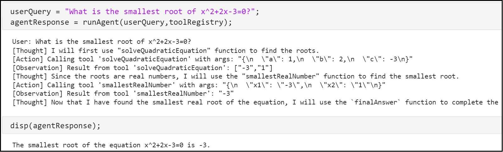
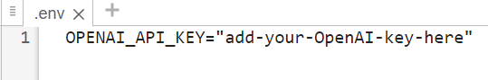
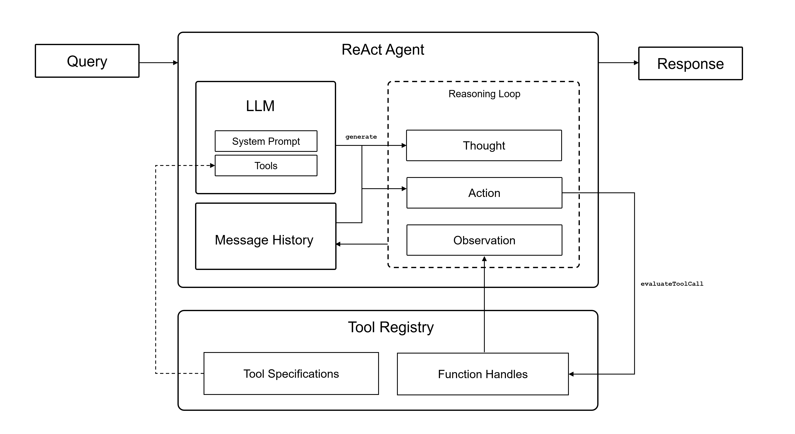

# Solve Simple Math Problem Using AI Agent

To run the code shown on this page, open the MLX file in MATLAB®: [mlx-scripts/SolveSimpleMathProblemUsingAIAgent.mlx](mlx-scripts/SolveSimpleMathProblemUsingAIAgent.mlx) 

This example shows how to build an AI agent to find the smallest root of a quadratic equation. 


AI agents are programs that autonomously plan and execute workflows. Typically, agents use large language models (LLMs) to process user queries and identify actions that need to be taken, also known as *tool calls*. The agent then executes the tool calls that the LLM has identified and returns the result to the LLM. Then, the LLM generates an answer or executes more tool calls.




# Specify OpenAI API Key

This example uses the OpenAI® API, which requires an OpenAI API key. For information on how to obtain an OpenAI API key, as well as pricing, terms and conditions of use, and information about available models, see the OpenAI documentation at [https://platform.openai.com/docs/overview](https://platform.openai.com/docs/overview).


To connect to the OpenAI API from MATLAB® using LLMs with MATLAB, specify the OpenAI API key as an environment variable and save it to a file called ".env".





To connect to OpenAI, the ".env" file must be on the search path. Load the environment file using the [`loadenv`](https://www.mathworks.com/help/matlab/ref/loadenv.html) function.

```matlab
loadenv(".env")
```
# Define Tools

First, to enable the LLM to make tool calls, define an `openAIFunction` object for each tool. You can then pass the tools to the LLM by specifying the `Tools` name\-value argument of the [`openAIChat`](../doc/functions/openAIChat.md) function.


For examples of how to use tool calling with the Large Language Models (LLMs) with MATLAB add\-on, see:

-  [Analyze Scientific Papers Using ChatGPT Function Calls](./AnalyzeScientificPapersUsingFunctionCalls.md) 
-  [Analyze Text Data Using Parallel Function Calls with ChatGPT](./AnalyzeTextDataUsingParallelFunctionCallwithChatGPT.md) 

In this example, use an LLM to find the smallest root of a second\-order polynomial. To find the smallest root of any second\-order polynomial, give the agent access to two tools: 

-  Compute the roots of a second\-order polynomial. 
-  Find the smallest real number from a list of two numbers. 
## Compute Roots of Second\-Order Polynomial

The `solveQuadraticEquation` function takes the three coefficients of a quadratic polynomial as input and uses the [`roots`](https://www.mathworks.com/help/matlab/ref/roots.html) function to return a column vector containing the two roots. The LLM used in this example uses textual representations of tool call results in JSON format. Roots of polynomials can be complex, but JSON does not support complex numbers. Therefore, specify the roots as strings.

```matlab
function strR = solveQuadraticEquation(a,b,c)
r = roots([a b c]);
strR = string(r);
end
```

Create an [`openAIFunction`](../doc/functions/openAIFunction.md) object that represents the `solveQuadraticEquation` function. Add the three coefficients as individual scalar input parameters.

```matlab
toolSolveQuadraticEquation = openAIFunction("solveQuadraticEquation", ...
    "Compute the roots of a second-order polynomial of the form ax^2 + bx + c = 0.");
toolSolveQuadraticEquation = addParameter(toolSolveQuadraticEquation,"a",type="number");
toolSolveQuadraticEquation = addParameter(toolSolveQuadraticEquation,"b",type="number");
toolSolveQuadraticEquation = addParameter(toolSolveQuadraticEquation,"c",type="number");
```
## Find Smallest Real Number

The `smallestRealNumber` function computes the smallest real number from a list of two numbers. The LLM used in this example expresses tool calls, including input parameters, in JSON format. As JSON does not support complex numbers, specify the roots as strings and convert them back into numbers using the [`str2double`](https://www.mathworks.com/help/matlab/ref/str2double.html) function.

```matlab
function xMin = smallestRealNumber(strX1,strX2)
allRoots = [str2double(strX1) str2double(strX2)];
realRoots = allRoots(imag(allRoots)==0);
if isempty(realRoots)
    xMin = "No real numbers.";
else
    xMin = min(realRoots);
end
end
```

Create an `openAIFunction` object that represents the `smallestRealNumber` function. Add the two numbers as individual string input parameters.

```matlab
toolSmallestRealNumber = openAIFunction("smallestRealNumber", ...
    "Compute the smallest real number from a list of two numbers.");
toolSmallestRealNumber = addParameter(toolSmallestRealNumber,"x1",type="string");
toolSmallestRealNumber = addParameter(toolSmallestRealNumber,"x2",type="string");
```
# Evaluate Tool Calls

To enable structured and scalable usage of multiple tools, store both the `openAIFunction` objects and their corresponding MATLAB function handles in a dictionary `toolRegistry`.

```matlab
toolRegistry = dictionary;
toolRegistry("solveQuadraticEquation") = struct( ...
    "toolSpecification",toolSolveQuadraticEquation, ...
    "functionHandle",@solveQuadraticEquation);
toolRegistry("smallestRealNumber") = struct( ...
    "toolSpecification",toolSmallestRealNumber, ...
    "functionHandle",@smallestRealNumber);
```

Define a function to evaluate tool calls identified by the LLM. LLMs can hallucinate tool calls or make errors about the parameters that the tools need. Therefore, first validate the tool name and parameters by comparing them to the `toolRegistry` dictionary. Then, run the functions associated with the tools. Return the result as an observation to the agent.

```matlab
function observation = evaluateToolCall(toolCall,toolRegistry)
% Validate tool name
toolName = toolCall.function.name;
assert(isKey(toolRegistry,toolName),"Invalid tool name ''%s''.",toolName)

% Validate JSON syntax
try
    args = jsondecode(toolCall.function.arguments);
catch
    error("Model returned invalid JSON syntax for arguments of tool ''%s''.",toolName);
end

% Validate tool parameters
tool = toolRegistry(toolName);
requiredArgs = string(fieldnames(tool.toolSpecification.Parameters));
assert(all(isfield(args,requiredArgs)),"Invalid tool parameters: %s",strjoin(fieldnames(args),","))

extraArgs = setdiff(string(fieldnames(args)),requiredArgs);
if ~isempty(extraArgs)
    warning("Ignoring extra tool parameters: %s",strjoin(extraArgs,","));
end

% Execute tool
argValues = arrayfun(@(fieldName) args.(fieldName),requiredArgs,UniformOutput=false);
observation = tool.functionHandle(argValues{:});
end
```
# Set Up ReAct Agent

Next, define the function that sets up and runs the AI agent.


The agentic architecture used in this example is based on a ReAct agent [\[1\]](#M_4d5d).





This architecture is an iterative workflow. For each iteration, the agent performs three steps:

1.  Thought — The agent plans the next action. To do this, first generate a thought in natural language, then generate a tool call based on that thought.
2. Action — The agent executes the next action.
3. Observation — The agent observes the tool output.

Define the function `runReActAgent` that answers a user query `userQuery` using the ReAct agent architecture and the tools provided in `toolRegistry`.

```matlab
function agentResponse = runReActAgent(userQuery,toolRegistry)
```

To ensure the agent stops after it answers the user query, create a tool `finalAnswer` and add it to the tool list.

```matlab
toolFinalAnswer = openAIFunction("finalAnswer","Call this when you have reached the final answer.");
tools = [toolRegistry.values.toolSpecification toolFinalAnswer];
```

Create a system prompt. Instruct the agent to call the `finalAnswer` tool after it answers the user query.

```matlab
systemPrompt = ...
    "You are a mathematical reasoning agent that can call math tools. " + ...
    "Solve the problem. When done, call the tool finalAnswer else you will get stuck in a loop.";
```

Connect to the OpenAI Chat Completion API using the [`openAIChat`](../doc/functions/openAIChat.md) function. Use the OpenAI model GPT\-4.1 mini. Provide the LLM with tools using the `Tools` name\-value argument. Initialize the message history.

```matlab
llm = openAIChat(systemPrompt,ModelName="gpt-4.1-mini",Tools=tools);
history = messageHistory;
```

Add the user query to the message history. Display the user query.

```matlab
history = addUserMessage(history,userQuery);
disp("User: " + userQuery);
```

Initialize the agentic loop. To ensure the program terminates, limit the number of iterations to `10`.

```matlab
maxSteps = 10;
stepCount = 0;
problemSolved = false;
while ~problemSolved
    if stepCount >= maxSteps
        error("Agent stopped after reaching maximum step limit (%d).",maxSteps);
    end
    stepCount = stepCount + 1;
```

Instruct the agent to plan the next step. Generate a response from the message history. To ensure the agent outputs text, set the `ToolChoice` name\-value argument to `"none"`.

```matlab
    history = addUserMessage(history,"Plan your single next step concisely.");
    [thought,completeOutput] = generate(llm,history,ToolChoice="none");
    disp("[Thought] " + thought);
    history = addResponseMessage(history,completeOutput);
```

Instruct the agent to always call a tool.

```matlab
    history = addUserMessage(history,"Execute the next step.");
    [~,completeOutput] = generate(llm,history,ToolChoice="required");
    history = addResponseMessage(history,completeOutput);
    actions = completeOutput.tool_calls;
```

If the agent calls the `finalAnswer` tool, add the final agent response to the message history.

```matlab
    if isscalar(actions) && strcmp(actions(1).function.name,"finalAnswer")
        history = addToolMessage(history,actions.id,"finalAnswer","Final answer below");
        history = addUserMessage(history,"Return the final answer as a statement.");
        agentResponse = generate(llm,history,ToolChoice="none");
        problemSolved = true;
```

Otherwise, log and evaluate each tool call in the agent output.

```matlab
    else
        for i = 1:numel(actions)
            action = actions(i);
            toolName = action.function.name;
            fprintf("[Action] Calling tool '%s' with args: %s\n",toolName,jsonencode(action.function.arguments));
            observation = evaluateToolCall(action,toolRegistry);
```

To enable the agent to observe the output, add the tool call result to the message history.

```matlab
            fprintf("[Observation] Result from tool '%s': %s\n",toolName,jsonencode(observation));
            history = addToolMessage(history,action.id,toolName,"Observation: " + jsonencode(observation));
        end
    end
end
end
```
# Answer Query

Define the query. Answer the query using the agent.

```matlab
userQuery = "What is the smallest root of x^2+2x-3=0?";
agentResponse = runReActAgent(userQuery,toolRegistry);
```

```matlabTextOutput
User: What is the smallest root of x^2+2x-3=0?
[Thought] I will solve the quadratic equation x^2 + 2x - 3 = 0 to find its roots.
[Action] Calling tool 'solveQuadraticEquation' with args: "{\"a\":1,\"b\":2,\"c\":-3}"
[Observation] Result from tool 'solveQuadraticEquation': ["-3","1"]
[Thought] I will find the smallest root from the roots -3 and 1.
[Action] Calling tool 'smallestRealNumber' with args: "{\"x1\":\"-3\",\"x2\":\"1\"}"
[Observation] Result from tool 'smallestRealNumber': -3
[Thought] The smallest root is -3. I will now provide the final answer.
```


Display the response.

```matlab
disp(agentResponse);
```

```matlabTextOutput
The smallest root of the equation x^2 + 2x - 3 = 0 is -3.
```

# References
<a id="M_4d5d"></a>

\[1\] Shunyu Yao, Jeffrey Zhao, Dian Yu, Nan Du, Izhak Shafran, Karthik Narasimhan, and Yuan Cao. "ReAct: Synergizing Reasoning and Acting in Language Models". ArXiv, 10 March 2023. [https://doi.org/10.48550/arXiv.2210.03629](https://doi.org/10.48550/arXiv.2210.03629).

