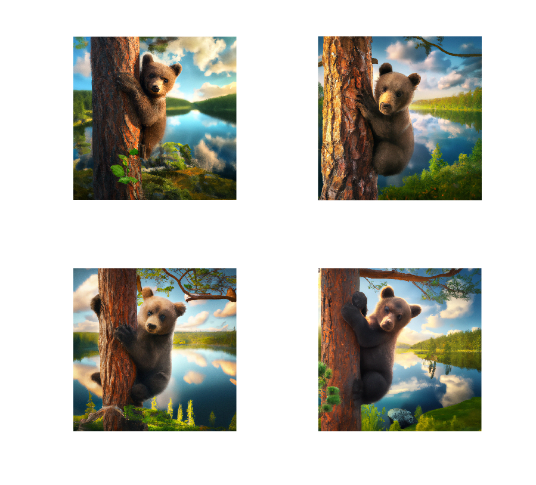
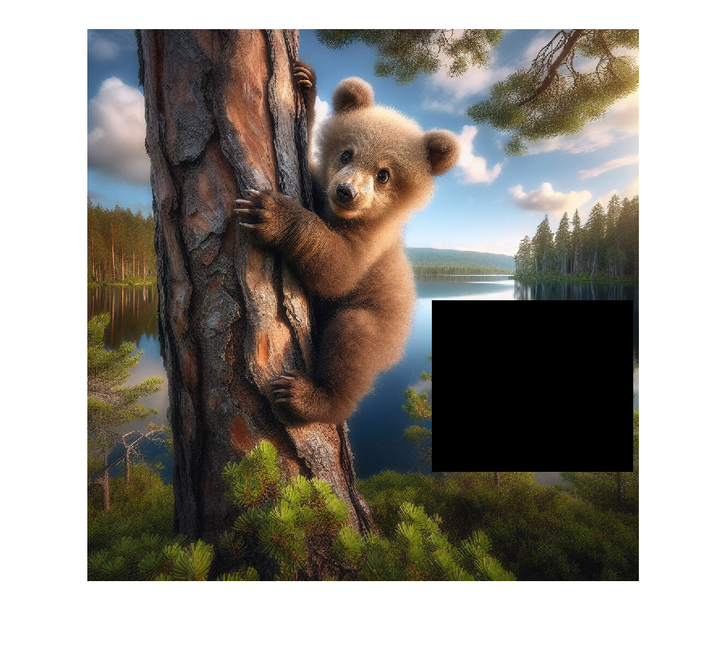

# Using DALL·E™ to Edit Images

To run the code shown on this page, open the MLX file in MATLAB: [mlx-scripts/UsingDALLEToEditImages.mlx](mlx-scripts/UsingDALLEToEditImages.mlx) 

This example shows how to generate and edit images using the `openAIImages` object.


To run this example, you need a valid OpenAI™ API key. Creating images using DALL•E may incur a fee.

```matlab
loadenv(".env")
addpath("../..")
```

We want to load images files relative to the project directory below:

```matlab
projectDir = fileparts(which("openAIImages"));
```
# Generate image variations

Use the image variation feature in DALL•E 2.

```matlab
mdl = openAIImages(ModelName="dall-e-2");
```

Show the image to get variations for. 

```matlab
imagePath = fullfile(projectDir,"examples","images","bear.png");
figure
imshow(imagePath)
```


Generate variations for that image.

```matlab
[images,resp] = createVariation(mdl, imagePath, NumImages=4);
if ~isempty(images)
    tiledlayout('flow')
    for ii = 1:numel(images)
        nexttile
        imshow(images{ii})
    end
else
    disp(resp.Body.Data.error)
end
```


# Edit an Image with DALL·E

Use an image containing a mask to apply modifications to the masked area.

```matlab
maskImagePath = fullfile(projectDir,"examples","images","mask_bear.png");
figure
imshow(maskImagePath)
```



Add a swan to the masked area using the function edit.

```matlab
[images,resp] = edit(mdl, imagePath, "Swan", MaskImagePath=maskImagePath);
if isfield(resp.Body.Data,'data')
    figure
    imshow(images{1});
else
    disp(resp.Body.Data.error)
end
```


*Copyright 2024 The MathWorks, Inc.*

